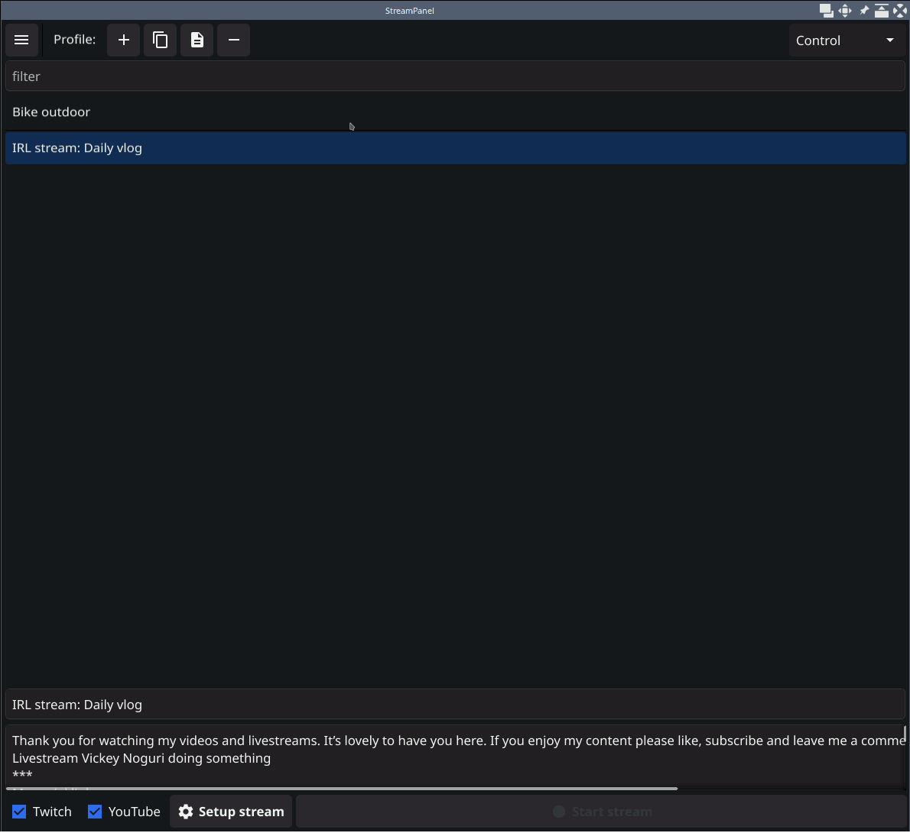

# About

[](https://github.com/xaionaro-go/streamctl/actions/workflows/rolling_release.yaml)

This is a program that is targeted on making IRL streaming as simple as possible.

# Install

## Windows

Go to [https://github.com/xaionaro-go/streamctl/releases](https://github.com/xaionaro-go/streamctl/releases), download streampanel-windows-amd64.zip, unpack it to a directory where you wish to store the application.

## Linux

### Prebuilt

Go to [https://github.com/xaionaro-go/streamctl/releases](https://github.com/xaionaro-go/streamctl/releases), download streampanel-linux-amd64, unpack it to a directory where you wish to store the application, and don't forget to make it executable, e.g.:
```sh
sudo chmod +x /usr/local/bin/streampanel
```

### Build from the source

```sh
apt install -fy libavcodec-dev libavdevice-dev libavfilter-dev libavformat-dev libavutil-dev libvlc-dev libx11-dev libxcursor-dev libxinerama-dev libxi-dev libglfw3-dev libasound2-dev libxxf86vm-dev
apt install -fy golang-go
go install fyne.io/fyne/v2/cmd/fyne@latest
git clone https://github.com/xaionaro-go/streamctl
cd streamctl
make streampanel-linux-amd64
```

## Android

Go to [https://github.com/xaionaro-go/streamctl/releases](https://github.com/xaionaro-go/streamctl/releases), download streampanel-arm64.apk on the smartphone, launch it, and install.


# How to use

`<TBD>`



# CLI: `streamctl`
```
xaionaro@void:~/go/src/github.com/xaionaro-go/streamctl$ go run ./cmd/streamctl/
Usage:
  /tmp/go-build2502186757/b001/exe/streamctl [command]

Available Commands:
  completion      Generate the autocompletion script for the specified shell
  generate-config
  help            Help about any command
  set-description
  set-title
  stream-end
  stream-start

Flags:
      --config-path string   the path to the config file (default "~/.streamctl.yaml")
  -h, --help                 help for /tmp/go-build2502186757/b001/exe/streamctl
      --log-level Level       (default warning)

Use "/tmp/go-build2502186757/b001/exe/streamctl [command] --help" for more information about a command.
```
